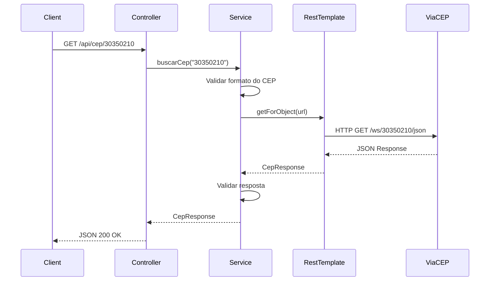
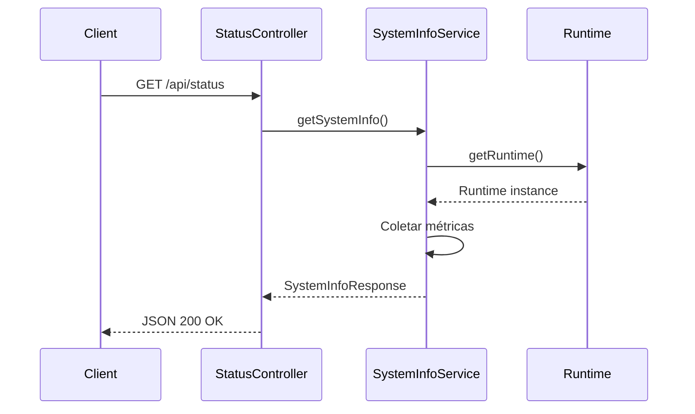

# Arquitetura do Sistema

Documentação da arquitetura e estrutura técnica da **DevOps Automation API**.

---

## Visão Geral

A DevOps Automation API segue uma arquitetura em camadas baseada no padrão **MVC (Model-View-Controller)** do Spring Boot, com separação clara de responsabilidades entre apresentação, lógica de negócio e acesso a dados externos.

### Princípios Arquiteturais

- ✅ **Separation of Concerns** - Camadas bem definidas
- ✅ **Dependency Injection** - Gerenciado pelo Spring Framework
- ✅ **RESTful Design** - APIs seguem princípios REST
- ✅ **Stateless** - Aplicação sem estado de sessão
- ✅ **Containerized** - Pronta para orquestração

---

## Arquitetura em Camadas

```
┌─────────────────────────────────────────────────────────┐
│                     CLIENT LAYER                        │
│  (Browser, cURL, Postman, External Services)            │
└────────────────────┬────────────────────────────────────┘
                     │
                     │ HTTP/HTTPS
                     │
┌────────────────────▼────────────────────────────────────┐
│              PRESENTATION LAYER                         │
│  ┌─────────────────┐        ┌─────────────────┐        │
│  │  Controllers    │        │   Templates     │        │
│  │  (@Controller)  │        │   (Thymeleaf)   │        │
│  │  (@RestCtrl)    │        │                 │        │
│  └─────────────────┘        └─────────────────┘        │
└────────────────────┬────────────────────────────────────┘
                     │
                     │ Method Calls
                     │
┌────────────────────▼────────────────────────────────────┐
│               SERVICE LAYER                             │
│  ┌─────────────────┐        ┌─────────────────┐        │
│  │  Services       │        │  Business       │        │
│  │  (@Service)     │        │  Logic          │        │
│  └─────────────────┘        └─────────────────┘        │
└────────────────────┬────────────────────────────────────┘
                     │
                     │ REST Client
                     │
┌────────────────────▼────────────────────────────────────┐
│            INTEGRATION LAYER                            │
│  ┌─────────────────┐        ┌─────────────────┐        │
│  │  RestTemplate   │        │  External       │        │
│  │  HTTP Client    │        │  APIs           │        │
│  └─────────────────┘        └─────────────────┘        │
└────────────────────┬────────────────────────────────────┘
                     │
                     │ HTTP Calls
                     │
             ┌───────▼─────────┐
             │   ViaCEP API    │
             │  (External)     │
             └─────────────────┘
```

---

## Estrutura de Diretórios

```
java-api/
├── src/
│   ├── main/
│   │   ├── java/br/com/java_api/
│   │   │   ├── JavaApiApplication.java      # Classe principal
│   │   │   ├── config/                      # Configurações
│   │   │   │   ├── RestTemplateConfig.java  # Bean de HTTP Client
│   │   │   │   └── OpenApiConfig.java       # Configuração Swagger
│   │   │   ├── controller/                  # Camada de apresentação
│   │   │   │   ├── HelloController.java     # API REST básica
│   │   │   │   ├── CepController.java       # API REST CEP
│   │   │   │   ├── StatusRestController.java# API REST status
│   │   │   │   ├── HomeController.java      # Views HTML
│   │   │   │   ├── StatusController.java    # View status HTML
│   │   │   │   ├── CepPageController.java   # View CEP HTML
│   │   │   │   └── CustomErrorController.java # Error handling
│   │   │   ├── service/                     # Lógica de negócio
│   │   │   │   ├── CepService.java          # Serviço de CEP
│   │   │   │   └── SystemInfoService.java   # Serviço de sistema
│   │   │   ├── dto/                         # Data Transfer Objects
│   │   │   │   ├── CepResponse.java         # DTO de CEP
│   │   │   │   └── SystemInfoResponse.java  # DTO de sistema
│   │   │   └── exception/                   # Tratamento de exceções
│   │   │       ├── GlobalExceptionHandler.java
│   │   │       ├── CepNotFoundException.java
│   │   │       └── InvalidCepException.java
│   │   └── resources/
│   │       ├── application.properties       # Configurações
│   │       ├── static/                      # Arquivos estáticos
│   │       │   └── device.json
│   │       └── templates/                   # Templates HTML
│   │           ├── home.html
│   │           ├── status.html
│   │           ├── cep.html
│   │           └── error/404.html
│   └── test/                                # Testes unitários
│       └── java/br/com/java_api/
│           ├── controller/                  # Testes de controllers
│           └── service/                     # Testes de services
├── target/                                  # Build artifacts
├── pom.xml                                  # Maven dependencies
├── Dockerfile                               # Container definition
└── mvnw                                     # Maven wrapper
```

---

## Componentes Principais

### 1. Controllers (Camada de Apresentação)

Responsáveis por receber requisições HTTP e retornar respostas.

#### REST Controllers (`@RestController`)

**HelloController**
```java
@RestController
@RequestMapping("/api")
public class HelloController {
    @GetMapping("/hello")
    public String hello() {
        return "Ola, Mundo da API!";
    }
}
```

**CepController**
```java
@RestController
@RequestMapping("/api/cep")
public class CepController {
    @Autowired
    private CepService cepService;
    
    @GetMapping("/{cep}")
    public ResponseEntity<CepResponse> consultarCep(@PathVariable String cep) {
        return ResponseEntity.ok(cepService.buscarCep(cep));
    }
}
```

**StatusRestController**
```java
@RestController
@RequestMapping("/api")
public class StatusRestController {
    @Autowired
    private SystemInfoService systemInfoService;
    
    @GetMapping("/status")
    public ResponseEntity<SystemInfoResponse> getStatus() {
        return ResponseEntity.ok(systemInfoService.getSystemInfo());
    }
}
```

#### View Controllers (`@Controller`)

Retornam views HTML renderizadas com Thymeleaf.

**HomeController** - Página inicial  
**StatusController** - Dashboard de status  
**CepPageController** - Formulário de CEP  

---

### 2. Services (Camada de Negócio)

Contêm a lógica de negócio e integração com APIs externas.

#### CepService

Responsável pela integração com a API ViaCEP.

```java
@Service
public class CepService {
    @Autowired
    private RestTemplate restTemplate;
    
    @Value("${api.viacep.url}")
    private String viaCepUrl;
    
    public CepResponse buscarCep(String cep) {
        // Validação
        if (!isValidCep(cep)) {
            throw new InvalidCepException("CEP inválido");
        }
        
        // Chamada à API externa
        String url = viaCepUrl + cep + "/json/";
        CepResponse response = restTemplate.getForObject(url, CepResponse.class);
        
        // Tratamento de erro
        if (response == null || response.hasError()) {
            throw new CepNotFoundException("CEP não encontrado");
        }
        
        return response;
    }
}
```

#### SystemInfoService

Coleta informações do sistema e ambiente.

```java
@Service
public class SystemInfoService {
    public SystemInfoResponse getSystemInfo() {
        Runtime runtime = Runtime.getRuntime();
        
        return SystemInfoResponse.builder()
            .hostname(getHostname())
            .freeMemory(formatBytes(runtime.freeMemory()))
            .totalMemory(formatBytes(runtime.totalMemory()))
            .maxMemory(formatBytes(runtime.maxMemory()))
            .processors(runtime.availableProcessors())
            .osName(System.getProperty("os.name"))
            .javaVersion(System.getProperty("java.version"))
            .build();
    }
}
```

---

### 3. DTOs (Data Transfer Objects)

Objetos para transferência de dados entre camadas.

#### CepResponse

```java
@Data
@Builder
public class CepResponse {
    private String cep;
    private String logradouro;
    private String complemento;
    private String bairro;
    private String localidade;
    private String uf;
    private String estado;
    private String regiao;
    private String ibge;
    private String ddd;
}
```

#### SystemInfoResponse

```java
@Data
@Builder
public class SystemInfoResponse {
    private String status;
    private String hostname;
    private String timestamp;
    private MemoryInfo memory;
    private CpuInfo cpu;
    private DiskInfo disk;
    private SystemInfo system;
}
```

---

### 4. Exception Handling

Tratamento centralizado de exceções.

#### GlobalExceptionHandler

```java
@RestControllerAdvice
public class GlobalExceptionHandler {
    
    @ExceptionHandler(CepNotFoundException.class)
    public ResponseEntity<ErrorResponse> handleCepNotFound(CepNotFoundException ex) {
        return ResponseEntity.status(HttpStatus.NOT_FOUND)
            .body(new ErrorResponse(ex.getMessage()));
    }
    
    @ExceptionHandler(InvalidCepException.class)
    public ResponseEntity<ErrorResponse> handleInvalidCep(InvalidCepException ex) {
        return ResponseEntity.status(HttpStatus.BAD_REQUEST)
            .body(new ErrorResponse(ex.getMessage()));
    }
    
    @ExceptionHandler(Exception.class)
    public ResponseEntity<ErrorResponse> handleGenericException(Exception ex) {
        return ResponseEntity.status(HttpStatus.INTERNAL_SERVER_ERROR)
            .body(new ErrorResponse("Erro interno do servidor"));
    }
}
```

---

### 5. Configuration

Configurações e beans do Spring.

#### RestTemplateConfig

```java
@Configuration
public class RestTemplateConfig {
    
    @Value("${api.connection.timeout}")
    private int connectionTimeout;
    
    @Value("${api.read.timeout}")
    private int readTimeout;
    
    @Bean
    public RestTemplate restTemplate() {
        HttpComponentsClientHttpRequestFactory factory = 
            new HttpComponentsClientHttpRequestFactory();
        factory.setConnectTimeout(connectionTimeout);
        factory.setReadTimeout(readTimeout);
        
        return new RestTemplate(factory);
    }
}
```

#### OpenApiConfig

```java
@Configuration
public class OpenApiConfig {
    @Bean
    public OpenAPI customOpenAPI() {
        return new OpenAPI()
            .info(new Info()
                .title("DevOps Automation API")
                .version("1.0.0")
                .description("API para ensinar DevOps com Spring Boot")
                .contact(new Contact()
                    .name("DevOps Team")
                    .url("https://github.com/iesodias")));
    }
}
```

---

## Fluxo de Dados

### Fluxo de Consulta de CEP



### Fluxo de Status do Sistema



---

## Arquitetura de Container

### Multi-stage Dockerfile

```dockerfile
# Stage 1: Build
FROM maven:3.9.6-amazoncorretto-17 AS builder
WORKDIR /build
COPY . .
RUN mvn clean package -DskipTests

# Stage 2: Runtime
FROM amazoncorretto:17-alpine
WORKDIR /app
COPY --from=builder /build/target/java-api-0.0.1-SNAPSHOT.jar app.jar
EXPOSE 8081
ENTRYPOINT ["java", "-jar", "app.jar"]
```

**Benefícios:**
- ✅ Imagem final menor (apenas runtime + JAR)
- ✅ Build isolado e reproduzível
- ✅ Não expõe código-fonte
- ✅ Mais rápido para deploy

---

## Integrações Externas

### ViaCEP API

**Base URL:** `https://viacep.com.br/ws/`

**Endpoint:** `GET /{cep}/json/`

**Timeout Configuration:**
- Connection Timeout: 5000ms
- Read Timeout: 10000ms

**Retry Strategy:**
- Atualmente sem retry automático
- Exceções são propagadas para o cliente

**Circuit Breaker:**
- Não implementado (considerar para produção)

---

## Monitoramento e Observabilidade

### Spring Boot Actuator

**Endpoints habilitados:**
- `/actuator/health` - Health check
- `/actuator/info` - Informações da aplicação

**Health Indicators:**
- Disk Space
- Ping
- Custom health checks (extensível)

**Métricas personalizadas:**
- Uso de memória (heap)
- CPU disponível
- Espaço em disco
- Nome do container/host

---

## Segurança

### Considerações Atuais

!!! warning "API Educacional"
    Esta API foi desenvolvida para fins educacionais e **não possui**:
    - Autenticação
    - Autorização
    - Rate limiting
    - Validação avançada de input
    - Sanitização de dados

### Melhorias para Produção

**Autenticação e Autorização:**
```java
// Adicionar Spring Security
@Configuration
@EnableWebSecurity
public class SecurityConfig {
    @Bean
    public SecurityFilterChain filterChain(HttpSecurity http) {
        http
            .authorizeHttpRequests(auth -> auth
                .requestMatchers("/actuator/**").hasRole("ADMIN")
                .requestMatchers("/api/**").authenticated()
                .anyRequest().permitAll()
            )
            .oauth2ResourceServer(OAuth2ResourceServerConfigurer::jwt);
        return http.build();
    }
}
```

**Rate Limiting:**
```java
// Adicionar Bucket4j
@Configuration
public class RateLimitConfig {
    @Bean
    public RateLimiter rateLimiter() {
        return RateLimiter.create(100.0); // 100 req/sec
    }
}
```

---

## Escalabilidade

### Horizontal Scaling

A aplicação é **stateless** e pronta para escalar horizontalmente:

```yaml
# Kubernetes Deployment
apiVersion: apps/v1
kind: Deployment
metadata:
  name: java-api
spec:
  replicas: 3  # Múltiplas instâncias
  selector:
    matchLabels:
      app: java-api
  template:
    spec:
      containers:
      - name: java-api
        image: devops-api:latest
        ports:
        - containerPort: 8081
```

### Load Balancing

```yaml
# Kubernetes Service
apiVersion: v1
kind: Service
metadata:
  name: java-api-service
spec:
  type: LoadBalancer
  selector:
    app: java-api
  ports:
  - port: 80
    targetPort: 8081
```

---

## Testabilidade

### Estrutura de Testes

```
src/test/java/br/com/java_api/
├── controller/
│   ├── HelloControllerTest.java
│   ├── CepControllerTest.java
│   └── StatusRestControllerTest.java
└── service/
    ├── CepServiceTest.java
    └── SystemInfoServiceTest.java
```

### Exemplo de Teste Unitário

```java
@SpringBootTest
@AutoConfigureMockMvc
class CepControllerTest {
    
    @Autowired
    private MockMvc mockMvc;
    
    @MockBean
    private CepService cepService;
    
    @Test
    void deveRetornarCepValido() throws Exception {
        CepResponse mockResponse = CepResponse.builder()
            .cep("30350-210")
            .logradouro("Rua Matipó")
            .build();
            
        when(cepService.buscarCep("30350210"))
            .thenReturn(mockResponse);
            
        mockMvc.perform(get("/api/cep/30350210"))
            .andExpect(status().isOk())
            .andExpect(jsonPath("$.cep").value("30350-210"));
    }
}
```

---

## Extensibilidade

### Adicionando Novos Endpoints

1. **Criar Controller:**
```java
@RestController
@RequestMapping("/api/novo")
public class NovoController {
    @GetMapping
    public ResponseEntity<String> novo() {
        return ResponseEntity.ok("Novo endpoint!");
    }
}
```

2. **Criar Service (se necessário):**
```java
@Service
public class NovoService {
    public String executarLogica() {
        return "Lógica de negócio";
    }
}
```

3. **Adicionar Testes:**
```java
@Test
void deveRetornarNovoEndpoint() {
    // Implementar teste
}
```

---

## Boas Práticas Implementadas

- ✅ **Separation of Concerns** - Camadas bem definidas
- ✅ **Dependency Injection** - Baixo acoplamento
- ✅ **RESTful API Design** - Padrões HTTP corretos
- ✅ **Exception Handling** - Tratamento centralizado
- ✅ **Configuration Management** - Externalized config
- ✅ **Documentation** - OpenAPI/Swagger
- ✅ **Health Checks** - Actuator endpoints
- ✅ **Containerization** - Docker multi-stage
- ✅ **Unit Testing** - Cobertura de testes
- ✅ **Code Organization** - Estrutura clara

---

## Referências

- [Spring Boot Documentation](https://spring.io/projects/spring-boot)
- [Spring Framework Reference](https://docs.spring.io/spring-framework/reference/)
- [REST API Best Practices](https://restfulapi.net/)
- [Docker Best Practices](https://docs.docker.com/develop/dev-best-practices/)
- [Kubernetes Documentation](https://kubernetes.io/docs/home/)

---

## Próximos Passos

- [API Reference](api.md) - Documentação detalhada dos endpoints
- [Deploy Guide](deploy.md) - Como fazer deploy da aplicação
- [Home](index.md) - Voltar à página inicial
